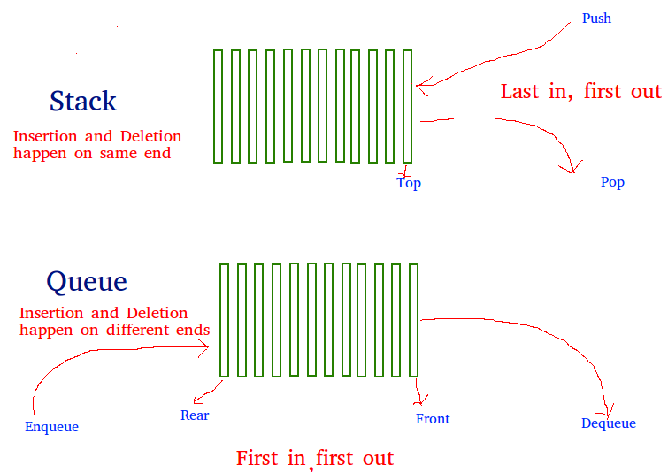

# Stacks and Queues

## Stack :

A stack is an abstract data type that follows the Last-In-First-Out (LIFO) principle. It behaves like a stack of objects, where the last object added is the first one to be removed.
Elements in a stack are added and removed from the top, which is known as the "top of the stack."

The primary operations performed on a stack are:
 - Push: Adds an element to the top of the stack.
 - Pop: Removes and returns the topmost element from the stack.
 - Peek or Top: Retrieves the topmost element without removing it.

## Queue:

A queue is an abstract data type that follows the First-In-First-Out (FIFO) principle. It represents a line of objects, where the first object added is the first one to be removed.
Elements in a queue are added at the rear (also known as the "back" or "tail") and removed from the front (also known as the "head").

The primary operations performed on a queue are:
 - Enqueue: Adds an element to the rear of the queue.
 - Dequeue: Removes and returns the frontmost element from the queue.
 - Front: Retrieves the frontmost element without removing it.

